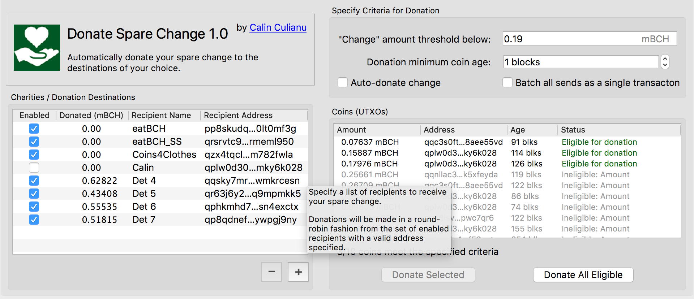

# Donate Spare Change - Electron Cash Plugin 

A plugin for Electron Cash that allows you to donate spare 'change' unspent outputs ('Coins' in Electron Cash parlance) automatically, after a certain age and below a certain amount, to charity.  This has the added benefit of preventing change outputs from being recombined with your addreses thus preserving your privacy.  

This is licensed under the MIT open source license.

## Write The Developer 🧐 ##

If you wish to contace me -- my email address is:

  calin DOT culianu "at" gmail.com

## Support The Developer 😃 ##

If you wish to encourage further development (or even just show your appreciation) please feel free to donate to:

  bitcoincash:qphax4s4n9h60jxj2fkrjs35w2tvgd4wzvf52cgtzc
    

## Installation ##

1. Download the [latest release](https://github.com/cculianu/DonateSpareChange/releases).
2. Get the latest version of the Electron Cash (either release or code from github -- make sure it has the Plugin Manager that allows addition of plugins).
3. From the Electron Cash application menu select `Tools -> Installed Plugins` and then click `Add Plugin`. Point the file dialog to the downloaded `donate_spare_change.zip`.
4. This plugin will then be installed and enabled.

## About Electron Cash Plugins ##

Electron Cash plugins have almost complete control over any wallets that are open.

As such, only run plugins you obtain from official sources and from developers that you trust.

I can assure you that I, Calin Culianu (cculianu), have written all of the code in this plugin myself and it contains 0% malicious code.  That being said: Feel free to audit the code yourself to be sure. :)

## Ultra-Brief Usage Overview ##

Once you have the plugin installed and enabled, it should appear as a tab in your wallet window. Here is a brief overview of what to do:

1. Select the `Donate Change` tab.
2. Specify a list of recipients (or just use the default list which are actual real charities).
3. Specify what "change" means to you: an amount and an age for coins defines which coins are considered for donation.
4. You can elect to either auto-donate as coins become eligible, or manually donate. Auto mode requires a non-password protected wallet. Manual mode notifies you as coins become available and you can then manually donate them from within the `Donate Change` tab.

## Known Issues ##

* No real suport for multi-signature wallets (yet! Sorry!).
* No testing and likely no support for hardware wallets (sorry again!).
* If any of the above issues are an issue to you, create an issue in this github! :)
